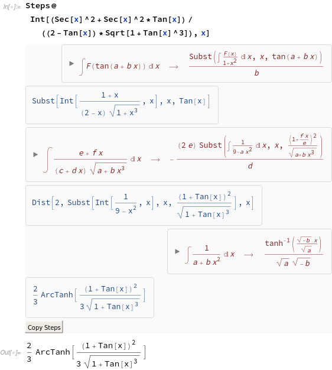

# Summary

Finding the antiderivative of expressions is often challenging and requires advanced mathematical skills
even for simple looking problems.
Computer algebra systems (CAS) like Mathematica (Wolfram Research, Inc., Champaign, IL), Maple (Maplesoft, a division of Waterloo Maple Inc., Waterloo, Ontario), and Maxima (maxima.sourceforge.net) provide integators to compute antiderivatives symbolically.
However, these systems supply no insight as to how an antiderivative is found or why it could not be computed.
Also they use advanced methods incomprehensible to humans that often result in huge antiderivatives unnecessarily involving special, or even hypergeometric, functions.

In this work, we present Rubi[@RubiOrg], a rule-based integrator and its implementation in Mathematica[@RubiMma].
Rubi systematically applies an extensive system of symbolic integration rules able to find the optimal antiderivative of a wide variety of mathematical expressions.
It currently has over 6600 rules implemented in Mathematica's pattern-matching language.
Some of these rules are based on integration *formulas* from [@Burington; @Zwillinger; @Abramowitz; @Gradshteyn] and then transformed into *rules* that include precise instructions as to when a formula should be applied.
Numerous other rules had to be derived during Rubi's development in order to integrate expressions not addressed by formulas in published tables. 

The key to the success of Rubi is the rigorous definition of conditions for the integration steps that determine under which circumstances the application of a specific rule is correct and useful.
Therefore, Rubi produces optimal antiderivatives that are often dramatically simpler than provided by the commercial CAS integrators.

Rubi is implemented as a Mathematica package that gives the user the option to inspect integration
steps and application conditions in detail. 
An extensive test-suite of over 70,000 integrals with known, optimal antiderivatives is employed to
thoroughly test the system before each new release.
Since it is also useful for testing other symbolic integrators, the entire test-suite is available on Rubi's website[@RubiOrg] expressed in Axiom, Maple, Mathematica, and Maxima syntax.
Also on the website are PDF files showing how Rubi and Mathematica's built-in integrator perform on the test-suite.

However, the value of Rubi goes far beyond its Mathematica implementation. All integration rules are
available in human readable form as PDF files or Mathematica notebooks which contain additional details
and references to the relevant literature. Since Rubi's rules in general only require a system for
manipulating symbolic expressions by applying pattern-based rules, it is feasible to implement the
integration rules in other systems.

That this is indeed possible was shown in the case of Symja[@Symja],
an open-source Java system for symbolic math, where we assisted in the translation and testing of Rubi's integration rules. Now, Rubi is used as the main integration engine in Symja for everything but the most trivial problems.
Furthermore, there are efforts to include Rubi into SymPy[@SymPy],
a Python library for symbolic mathematics, which would directly open the way to use it in Sage[@Sage],
a free and open-source CAS.

Ultimately, the rationale behind Rubi is to make rule-based integration publicly available to enable researchers and
enthusiast to find optimal antiderivatives and to verify the correctnes of each integration step
in the context of their problems.

# Short Example

Figure 1 shows the computation of

$$\int \frac{\sec(x)^2+\sec(x)^2\cdot\tan(x)}{(2-\tan(x))\cdot\sqrt{1+\tan(x)^3}} \; dx$$

using Rubi when all integration steps are displayed.
The specific rules that are applied are shown in red and it is possible to open the rule display to inspect the exact conditions that need to hold to make the transformation valid.
In blue, the intermediate expressions are visible and at the end the final antiderivative is returned.
It should be noted that the size of the found antiderivative is 25, counting the leafs in the expression tree of the result.
In comparison, Mathematica' current version 11.3 returns an antiderivative that has a leaf count of 290 and contains complex terms.

# Acknowledgements

We to thank David Jeffrey, Daniel Lichtblau, David Stoutemyer, and Martin Welz for contributions and fruitful discussions.

# References
